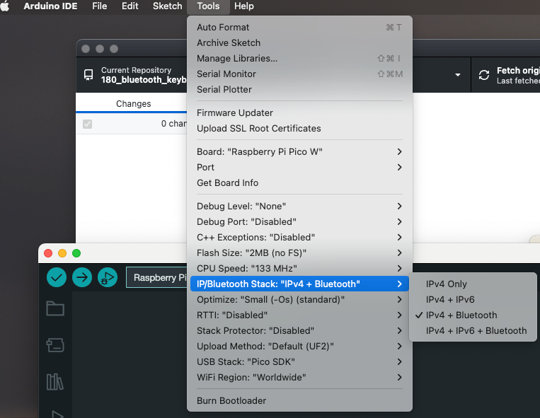
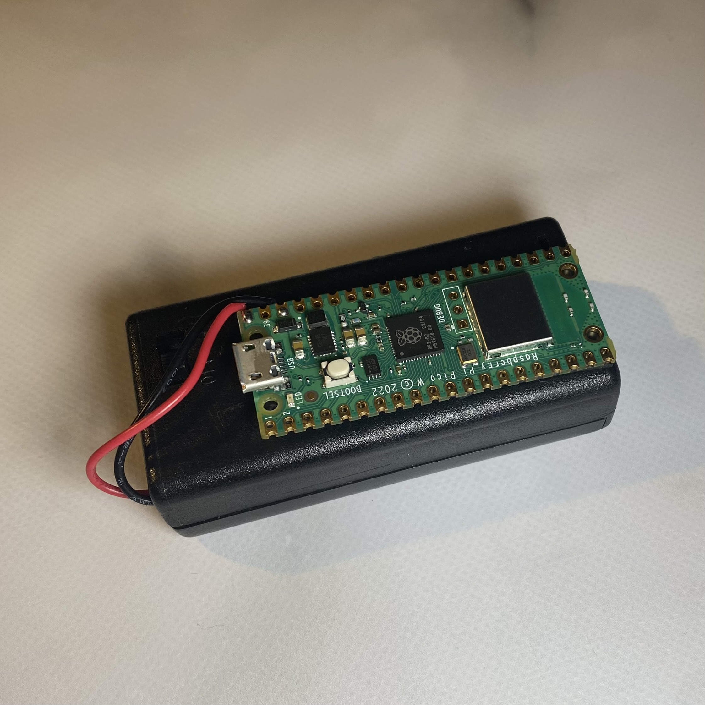

## Overview

This is a tool for entering a password, which connects to your computer using Bluetooth.
To enter the preset password, press the BOOTSEL button.

This tool may be good for those who find it tedious to enter passwords over and over again in a day.

## Software
- Arduino IDE
  - needs to select the stack for IPv4 + Bluetooth before complile the ocde.

## Hardware

- Raspberry pi pico W.
- USB battery or external battery, e.g., two AA batteries
- Connect to minus for GND and plus for VBUS.

## How to Use
- Pairing with your target PC at first
- Press BOOTSEL button for input characters

## WARNING!

- When connecting the PC and Raspberry Pi pico W with a USB cable, the external power supply must be disconnected.

